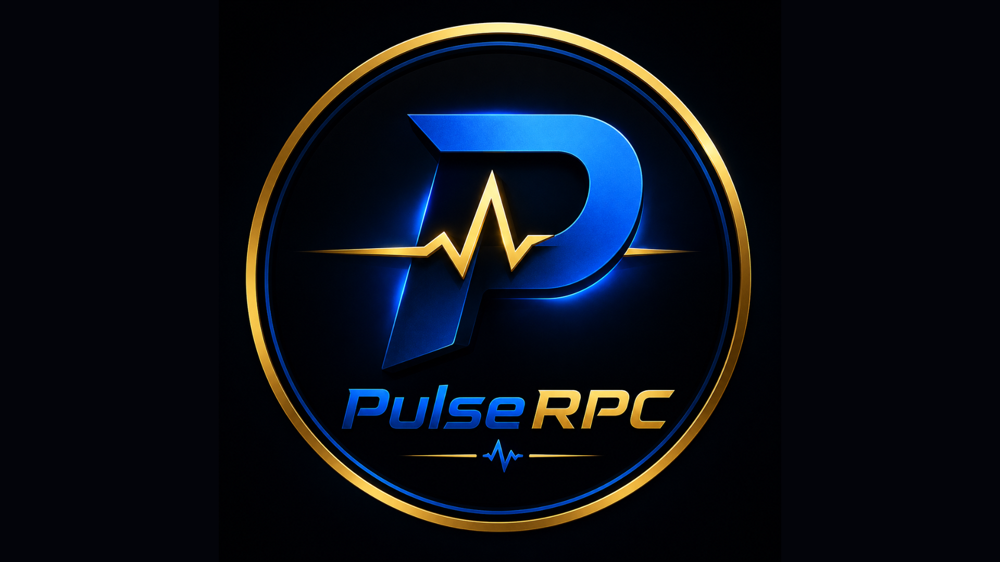

<p align="center">
  
</p>

<h1 align="center">PulseRPC</h1>

<p align="center">
  Create and customize Discord Rich Presence with ease.
</p>

<p align="center">
  
  
  

  <a href="https://shadow-wolf-studios.itch.io">
    
  </a>
</p>

---

# 🚀 About PulseRPC

PulseRPC is a modern Discord Rich Presence editor built with **Python**, **PySide6**, and **PyPresence**.

Create custom Discord statuses without writing code. Configure images, buttons, descriptions, timers, and more through a simple graphical interface.

---

# ✨ Features

## 🎮 Discord Rich Presence
- Custom activity titles
- Custom descriptions
- Large image support
- Small image support
- Hover text support
- Elapsed timer support

## 🔗 Rich Presence Buttons
- Up to 2 Discord buttons
- Custom labels
- Custom URLs
- URL validation

## 💾 Profile System
- Save profiles as `.prp`
- Load profiles instantly
- Share profiles with friends

## ⚙️ Settings
- Save application IDs
- Startup options
- Theme selection
- Button color customization
- Text color customization

## 📦 Update Checker
- Automatic update detection
- Manual update checks
- Version display
- Update notes support

## 📚 Tutorials
- Built-in tutorial section
- Video guides
- Quick-start resources

---

# 📸 Screenshots

## Main Interface

> Add screenshots here


## Settings

> Add screenshots here


---

# 🛠 Requirements

- Windows 10 / 11
- Python 3.10+
- Discord Desktop App

---

# 📥 Installation

## Download Release

1. Visit the Releases page.
2. Download the latest version.
3. Extract the files.
4. Launch `PulseRPC.exe`.

---

## Build From Source

Clone the repository:

```bash
git clone https://github.com/ShadowWolfStudios/PulseRPC.git
cd PulseRPC
```

Install dependencies:

```bash
pip install -r requirements.txt
```

Run:

```bash
python main.py
```

---

# 🔧 Creating a Discord Application

1. Open the Discord Developer Portal.
2. Create a New Application.
3. Copy the Application ID.
4. Paste it into PulseRPC Settings.
5. Upload Rich Presence assets.
6. Start creating your custom presence.

---

# 📝 Example Rich Presence

**Title**
```
Playing PulseRPC
```

**Description**
```
Creating custom Discord statuses
```

**Buttons**
```
Website
Discord Server
```

---

# 📋 Changelog

## Version 1.2.0

### Added
- Profile saving/loading
- Update checker
- Tutorial page
- Presence buttons

### Improved
- Settings management
- Connection testing
- User interface layout

### Fixed
- RPC connection issues
- Settings persistence bugs

---

# 🤝 Contributing

Contributions, suggestions, and bug reports are welcome.

If you'd like to help improve PulseRPC:

1. Fork the repository
2. Create a feature branch
3. Commit your changes
4. Open a pull request

---

# 🐛 Reporting Bugs

Found an issue?

Please include:

- PulseRPC version
- Windows version
- Error message
- Steps to reproduce

---

# 🌐 Links

### GitHub
https://github.com/ShadowWolfStudios

### Website
https://sws.rf.gd/

### Discord
https://discord.gg/WKqKRTfHcN

### Itch.io
https://shadow-wolf-studios.itch.io

### Donations
https://streamelements.com/ttv_wolfbro/tip

---

# 📄 License

This project is licensed under the MIT License.

---

<p align="center">
  Made with ❤️ by Shadow Wolf Studios
</p>
